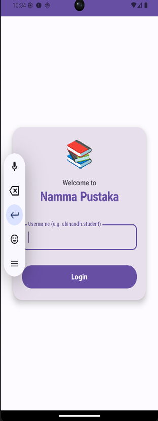
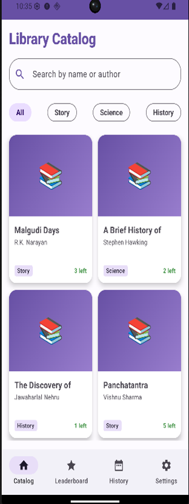
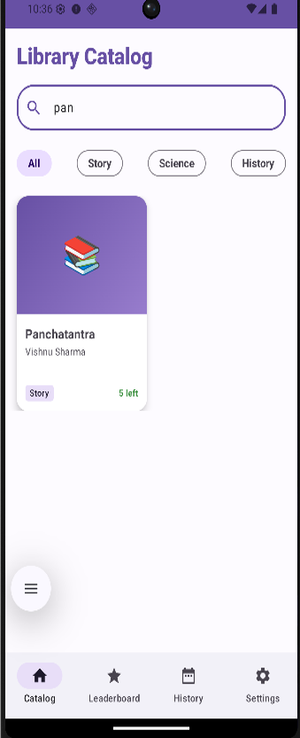
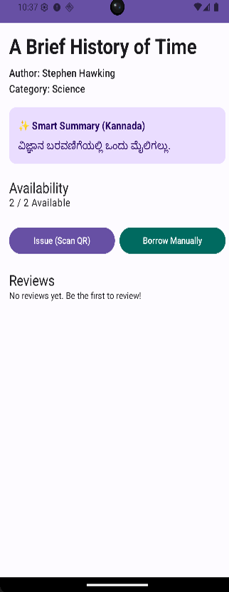
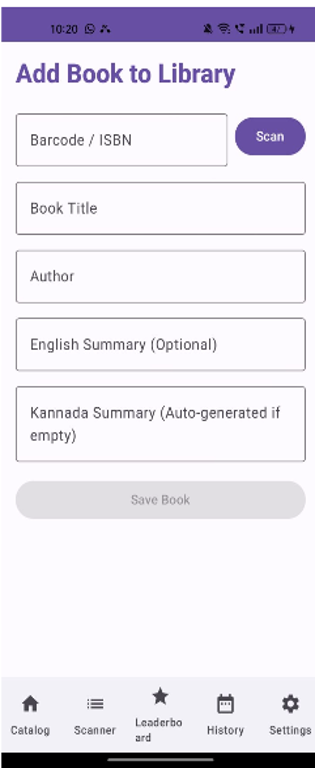
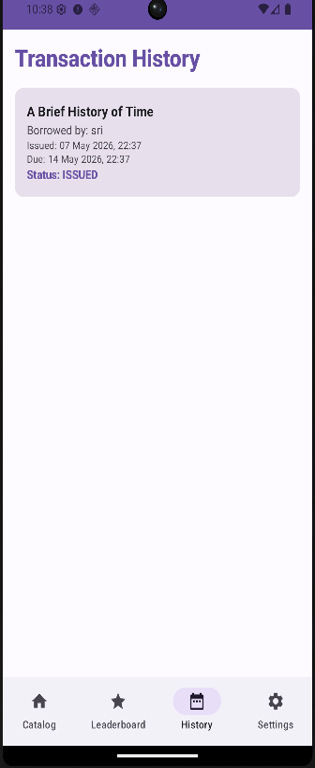
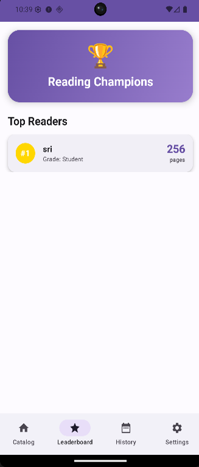
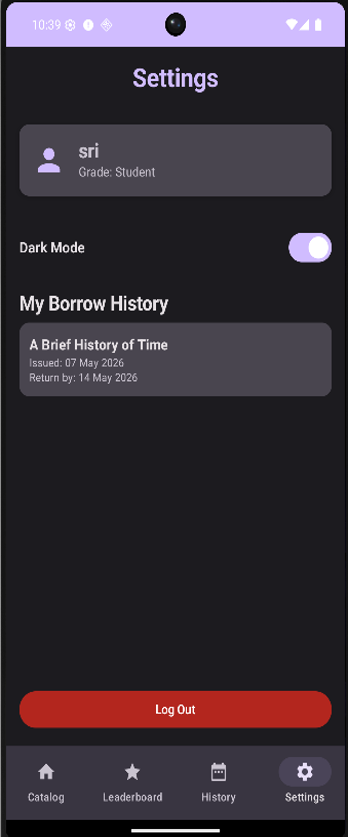

# 📚 Namma-Pustaka — Smart Library Assistant

> A comprehensive offline-first Smart Library Assistant for rural schools, built with modern Android technologies and powered by Google Gemini AI.

---

## 🧩 Problem Statement

Rural school libraries face critical challenges that go unaddressed:

- No digital catalog — books are tracked on paper registers that get lost or damaged
- Teachers have no way to monitor which student has borrowed which book
- Overdue books are never followed up because there's no automated reminder system
- Students from Kannada-medium schools struggle to understand English book summaries
- There is no incentive system to motivate students to read more

**Namma-Pustaka** solves all of these problems in a single, offline-capable Android application.

---

## ✨ Features

### 👤 For Students
- Login with name and grade — no password needed
- Browse the full book catalog filtered by category (Story, Science, History)
- Search books by name or author in real time
- Read AI-generated **Kannada summaries** for every book
- Borrow books via **QR scan** or manually (emulator-friendly)
- View personal borrow history with due dates
- Track your rank on the **Reading Champions Leaderboard**

### 🧑‍🏫 For Teachers
- Add new books by scanning barcodes/ISBN or manually filling a form
- Manage student accounts
- Monitor all active borrow transactions
- Receive **daily overdue notifications** automatically

### 🤖 AI-Powered
- Gemini API generates a 2-sentence Kannada summary for every book
- Summary is auto-generated when a new book is added (if left empty)

### 📊 Leaderboard
- Top readers ranked by total pages read
- Visualized with **MPAndroidChart** bar chart
- Updates instantly after every borrow

---

## 🛠️ Tech Stack

| Layer | Technology |
|---|---|
| Language | Kotlin |
| UI Framework | Jetpack Compose + Material 3 |
| Architecture | MVVM (Model-View-ViewModel) |
| Local Database | Room Database |
| AI / Summarization | Google Gemini API (`gemini-1.5-flash`) |
| QR / Barcode Scanning | Google ML Kit Barcode Scanning + CameraX |
| Background Tasks | WorkManager (PeriodicWorkRequest) |
| Charts | MPAndroidChart (via `AndroidView` wrapper) |
| Build System | Gradle Kotlin DSL |
| State & Preferences | SharedPreferences (user session) |

---

## 📱 Screenshots

### Student View

| Login | Library Catalog | Search Results | Book Detail |
|---|---|---|---|
|  |  |  |  |

### Teacher / Admin View

| Add Book | Transaction History | Leaderboard | Settings |
|---|---|---|---|
|  |  |  |  |

> 📸 Screenshots taken from the running app on Android Emulator (API 34).

---

## 🎬 Demo Video

> 📹 **[Watch the full demo on YouTube / Drive](https://youtu.be/-CMt2JwFfZ4?si=SSQuOGCoqM3ryhe4)**

---

## 🔄 QR Workflow

```
┌─────────────────────────────────────────────────────────────┐
│                    QR SCANNER WORKFLOW                      │
│                                                             │
│  ISSUE A BOOK                    ADD A NEW BOOK             │
│  ─────────────                   ────────────────           │
│  1. Open Book Detail             1. Open Scanner Screen     │
│  2. Tap "Issue (Scan QR)"        2. Switch to "Add Book"    │
│  3. Scan book's QR code          3. Scan barcode / ISBN     │
│  4. Transaction is recorded      4. Fill title & author     │
│  5. Available copies reduced     5. Gemini auto-generates   │
│  6. Pages added to leaderboard      Kannada summary         │
│                                  6. Book saved to catalog   │
│  RETURN A BOOK                                              │
│  ─────────────                                              │
│  1. Open Scanner Screen                                     │
│  2. Scan book QR                                            │
│  3. Transaction marked RETURNED                             │
│  4. Available copies restored                               │
└─────────────────────────────────────────────────────────────┘
```

> 💡 **Emulator users:** Use the **"Borrow Manually"** button on the Book Detail screen to test the full borrow flow without a physical camera.

---

## 🤖 AI Summary Explanation

Namma-Pustaka uses the **Google Gemini API** (`gemini-1.5-flash` model) to generate short, readable book summaries in **Kannada** — the regional language of Karnataka.

**How it works:**

1. When a book is added (via scan or manually), the app calls `GeminiHelper.kt`
2. The following prompt is sent to the Gemini API:
   ```
   "Provide a 2-sentence summary of the book '[Book Title]' by '[Author]' in Kannada."
   ```
3. The response is stored in the Room database alongside the book record
4. The Kannada summary is displayed on the **Book Detail Screen** under ⭐ Smart Summary (Kannada)

> ⚠️ **Important:** A valid Google Gemini API key is required for this feature. See setup instructions below.

---

## 🗂️ Folder Structure

```
Namma-Pustaka-App/
├── app/
│   ├── build.gradle.kts
│   ├── proguard-rules.pro
│   └── src/
│       ├── androidTest/
│       ├── test/
│       └── main/
│           ├── AndroidManifest.xml
│           ├── java/com/example/nammapustaka/
│           │   ├── ai/
│           │   ├── data/
│           │   │   ├── dao/
│           │   │   ├── entity/
│           │   │   └── AppDatabase.kt
│           │   ├── repository/
│           │   ├── navigation/
│           │   ├── ui/
│           │   │   ├── components/
│           │   │   ├── screens/
│           │   │   └── theme/
│           │   ├── viewmodel/
│           │   ├── vision/
│           │   ├── workers/
│           │   ├── utils/
│           │   └── MainActivity.kt
│           └── res/
│
├── gradle/
│   └── wrapper/
│
├── screenshots/
│   ├── login.png
│   ├── catalog.png
│   ├── search.png
│   ├── detail.png
│   ├── add_book.png
│   ├── history.png
│   ├── leaderboard.png
│   ├── settings.png
│   └── scanner.png
│
├── build.gradle.kts
├── settings.gradle.kts
├── gradle.properties
├── gradlew
├── gradlew.bat
├── .gitignore
└── README.md
```

---

## ⚙️ Setup Instructions

### Prerequisites

- Android Studio **Hedgehog (2023.1.1)** or later
- JDK 17
- Android SDK API 26+ (minSdk) / API 34 (targetSdk)
- A valid **Google Gemini API key** — get one free at [aistudio.google.com](https://aistudio.google.com)

### Step 1 — Clone the Repository

```bash
git clone https://github.com/Abinandh196/Namma-Pustaka-App.git
cd Namma-Pustaka-App
```

### Step 2 — Add Your Gemini API Key

Open `app/src/main/java/com/example/nammapustaka/utils/Constants.kt` and replace the placeholder:

```kotlin
// Constants.kt
object Constants {
    const val GEMINI_API_KEY = "YOUR_ACTUAL_GEMINI_API_KEY_HERE"
}
```

> 🔒 **Tip:** For production, store your key in `local.properties` and read it via `BuildConfig` to avoid committing it to Git.

### Step 3 — Open in Android Studio

```
File → Open → Select the NammaPustaka root folder
```

Wait for Gradle to sync and download all dependencies.

### Step 4 — First Run (Important!)

> ⚠️ If you previously installed an older version of the app, **uninstall it first** from your emulator/device to clear stale database data.

### Step 5 — Run the App

```
Shift + F10  (Run)
```

Or use the green ▶ Run button in Android Studio.

---

## 🚀 Run Commands

```bash
# Build debug APK
./gradlew assembleDebug

# Install on connected device/emulator
./gradlew installDebug

# Run unit tests
./gradlew test

# Clean build
./gradlew clean

# Build release APK (requires signing config)
./gradlew assembleRelease
```

The debug APK will be output to:
```
app/build/outputs/apk/debug/app-debug.apk
```

---

## 🔮 Future Scope

| Feature | Description |
|---|---|
| 🌐 Multi-language AI summaries | Extend Gemini summaries to Hindi, Tamil, Telugu |
| ☁️ Cloud sync | Firebase Firestore for multi-school / multi-device support |
| 🔐 Real authentication | Teacher admin login with role-based access control |
| 🎙️ Voice search | Search books in Kannada using Speech-to-Text API |
| 📈 Advanced analytics | Reading trends, popular categories, monthly reports |
| 👨‍👩‍👧 Multi-user roles | Separate student, teacher, and librarian dashboards |
| 🤖 AI recommendations | Gemini-powered "books you might like" suggestions |
| 📲 Student self-service | Students scan their own ID card to borrow books |

---

## 👨‍💻 Author

**Abinandh K V**
- USN: 1GD22CS003
- Role: Android App Development Intern
- Organization: MindMatrix
- College: Gopalan College of Engineering & Management, VTU

---

## 🙏 Acknowledgments

Special thanks to:
- **MindMatrix** organization and mentors for guidance throughout the internship
- Faculty guides at **Gopalan College of Engineering and Management**
- Google for the **Gemini API** and **ML Kit** open tooling

---

## 📄 License

```
MIT License — feel free to use, modify, and distribute with attribution.
```
